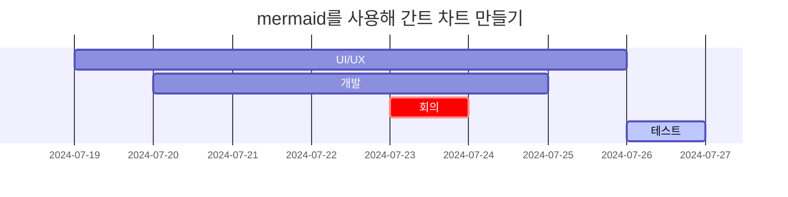
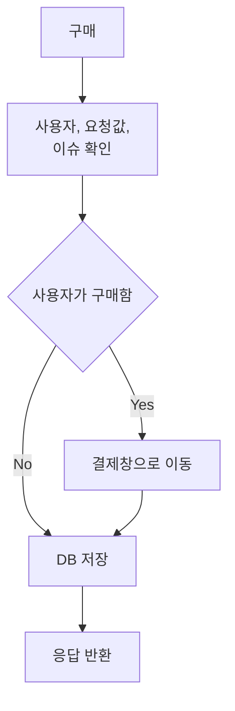

## 텍스트

### 제목

# H1 제목 (# 제목)
{: .mt-4 .mb-0 }

## H2 제목 (## 제목)
{: data-toc-skip='' .mt-4 .mb-0 }

### H3 제목 (### 제목)
{: data-toc-skip='' .mt-4 .mb-0 }

#### H4 제목 (#### 제목)
{: data-toc-skip='' .mt-4 .mb-0 }

##### H5 (# 5개)
{: .mt-4 .mb-0 }

###### H6 (H6 아래로는 없음)
{: .mt-4 .mb-0 }

본문 글자 크기<br/>

<br/>

제목 태그 중 toc에 포함하고 싶지 않은 제목이 있을 경우 `{: data-toc-skip=''}`을 설정하면 toc에 포함되지 않는다. 현재 사용 중인 jekylle chirpy 테마에서 toc에 포함되는 것은 H2~H4까지 이다.

### List

#### 순서가 있는 List

```markdown
1. 첫 번째
2. 두 번째
3. 세 번째
```
{: .nolineno}

↓

1. 첫 번째
2. 두 번째
3. 세 번째

#### 순서가 없는 List

```markdown
- 이것도 되고
* 이것도 되고
  - 탭으로 들여쓰면 내려갑니다.
+ 이것도 됩니다.
```
{: .nolineno}

↓

- 이것도 되고
* 이것도 되고
  - 탭으로 들여쓰면 내려갑니다.
+ 이것도 됩니다.

#### Todo List

```markdown
- [x] 오늘 할 일
  - [x] 일어나기
  - [x] 물 마시기
  - [x] 밥 먹기

- [ ] 내일 할 일
  - [ ] 잠 자기
  - [ ] 노래 듣기
```
{: .nolineno}

↓

- [x] 오늘 할 일
  - [x] 일어나기
  - [x] 물 마시기
  - [x] 밥 먹기

- [ ] 내일 할 일
  - [ ] 잠 자기
  - [ ] 노래 듣기


#### 설명이 있는 List

```markdown
이렇게 하고
: 이렇게 하면 됩니다.

고구마 라떼
: 맛있다.
```
{: .nolineno}

↓

이렇게 하고
: 이렇게 하면 됩니다.

고구마 라떼
: 맛있다.

### 인용구

```markdown
> 인용하는 방법
```
{: .nolineno}

↓

> 인용하는 방법

### Prompts

```markdown
> 팁
{: .prompt-tip }

> 정보
{: .prompt-info }

> 주의
{: .prompt-warning }

> 위험
{: .prompt-danger }
```
{: .nolineno}

↓

> 팁
{: .prompt-tip }

> 정보
{: .prompt-info }

> 주의
{: .prompt-warning }

> 위험
{: .prompt-danger }

### 테이블

```markdown
// :가 없으면 default (왼쪽 정렬)
| 마우스    |   키보드    |    스마트폰 |
| :-------- | :---------: | ----------: |
| 왼쪽 정렬 | 가운데 정렬 | 오른쪽 정렬 |
| 로지텍    |    콕스     |      갤럭시 |
| 레이저    |  레오폴드   |      아이폰 |
| 로캣      |   키크론    |             |
```
{: .nolineno}

↓

| 마우스    |   키보드    |    스마트폰 |
| :-------- | :---------: | ----------: |
| 왼쪽 정렬 | 가운데 정렬 | 오른쪽 정렬 |
| 로지텍    |    콕스     |      갤럭시 |
| 레이저    |  레오폴드   |      아이폰 |
| 로캣      |   키크론    |             |


### 링크

```markdown
// {: target="\_blank"}를 뒤에 붙이면 새 창에서 열리도록 할 수 있음
[화면에 보여줄 내용](url){: target="\_blank"}
```
{: .nolineno}

↓

[유투브](https://www.youtube.com/?app=desktop&hl=ko&gl=KR){: target="\_blank"}


### Footnote

footnote[^footnote]로 설정한 단어의 오른쪽 상단 숫자를 클릭하면 하단의 설명 부분으로 이동된다. footnote는 `[^footnote]` 등으로 설정할 수 있으며, footnote[^fn-nth-2]마다 다른 이름을 붙여주어야 한다.

### Inline code

```markdown
`이 안에 쓰면 된다.`
```
{: .nolineno}

↓

`이 안에 쓰면 된다.`


### Filepath

```markdown
`/path/to/the/file.extend`{: .filepath}
```
{: .nolineno}

↓

`/assets/img/favicons/favicon.io`{: .filepath}

## 코드

- ``` 뒤에는 아무것도 없어도 되고, 특정 언어여도 되고, 특정 파일이어도 된다.
  - 명시하지 않을 경우 : 기본값은 TEXT
  - 명시했을 경우 : 해당 언어나 파일에 맞게 하이라이팅 됨

### 명시하지 않았을 때

{: .normal width="200" height="136" }

↓

```
코드 블럭
code block
```

### 명시했을 때

#### 언어 명시

{: .normal width="200" height="136" }

↓

```java
@GetMapping("/")
public String home() {
    return "home";
}
```

#### 파일명 명시

{: .normal width="200" height="136" }

↓

```_sass/main.bundles.scss
@import 'dist/bootstrap';
@import 'main';
```

### OPTION

#### 코드 블럭의 Line 번호 없애기

`{: .nolineno}` 를 코드 블럭 하단에 넣는다.<br/>

{: .normal width="200" height="136" }

↓

```text
첫번째 줄
두번째 줄
세번째 줄
```
{: .nolineno}


## 수식

웹 브라우저에서 수식을 작성헐 때는 [**Mathjax**](https://www.mathjax.org/)를 사용한다.<br/>
chirpy에서 Mathjax를 사용하려면 Front Matter에 `math: true`를 추가해주어야 한다.<br/>
<br/>

> Mathjax는 수식이 삽입된 문서를 아름답게 구성하는 LaTeX 방식으로 HTML 문서에 수식을 삽입할 수 있도록 구현한 JavaScript 라이브러리로, 아파치 라이선스에 따라 오픈 소스 소프트웨어로 제공된다.
{: .prompt-tip }

### 하나의 문단을 차지하는 수식 입력 방법

$$
\begin{equation}
  \sum_{n=1}^\infty 1/n^2 = \frac{\pi^2}{6}
  \label{eq:series}
\end{equation}
$$

위 수식은 아래의 코드를 통해 나타낼 수 있다.

```markdown
$$
\begin{equation}
  \sum_{n=1}^\infty 1/n^2 = \frac{\pi^2}{6}
  \label{eq:series}
\end{equation}
$$

```

### 문장 안에 수식 입력하는 방법

문장 안에 수식을 입력하면 다음과 같이 나타난다. $a \ne 0$ 일 때 $ax^2 + bx + c = 0$ 이다.<br/>
위 수식은 다음과 같다. ` $a \ne 0$ 일 때 $ax^2 + bx + c = 0$ 이다.`<br/>

### 수식 참조하는 방법

`\eqref{eq:series}`를 통해 위쪽의 문단형 수식을 참조할 수 있다. \eqref{eq:series}를 클릭하면 해당 수식 위치로 스크롤이 이동된다.<br/>
참조는 수식 코드 내 label의 {eq:(라벨)}와 \eqref의 {eq:(라벨)} 안의 내용이 동일한 곳으로 설정된다.

### 참고

[MATHJAX로 수식 입력하는 방법](https://sasamath.com/blog/tip-collection/how-to-write-equations-in-mathjax/)


## 다이어그램

Mermaid 툴을 사용하면 Markdown 문법을 이용하여 시각적인 다이어그램을 표현할 수 있다.<br/>
각 코드의 앞에 \를 지우고 작성해야 한다. 아래는 코드 블럭 안에 예시 코드를 보여주기 위해 넣었다.

### 간트 차트

```markdown
\```mermaid
 gantt
  title  mermaid를 사용해 간트 차트 만들기
  UI/UX :a, 2024-07-19, 1w
  개발 :b, 2024-07-20, 1w
  회의 :crit, c, 2024-07-23, 1d
  테스트 :active, d, after c b a, 1d
\```
```

↓



### 플로우차트

```markdown
\```mermaid
flowchart TD
  A[구매] --> B;
  B[사용자, 요청값, \n 이슈 확인] --> C;
  C{사용자가 구매함} -->|Yes| E;
  C -->|No| G;
  E[결제창으로 이동] --> G;
  G[DB 저장] --> I;
  I[응답 반환];
\```
```

↓



외에도 시퀀스 다이어그램, 클래스 다이어그램 등의 UML을 그릴 수 있다.

### 참고

[Mermaid](https://mermaid.js.org/)
[[markdown] mermaid를 이용해서 UML 그리기 - 플로우차트](https://sabarada.tistory.com/209)

## 이미지 & 동영상

### 이미지

#### 캡션


_테스트용 이미지의 캡션입니다._

```markdown

_Image Caption_
```
{: .nolineno}

위와 같이 이미지에 캡션을 넣고 싶으면 이미지 아래에 이탤릭체로 캡션 내용을 적으면 된다.


#### 크기 설정

{: width="100" height="100"}

↓

```markdown
{: width="100" height="100"}
```
{: .nolineno}

{중괄호} 안에 width와 height를 넣어 크기를 지정할 수 있다. chirpy 버전(5.0.0 이상)에 따라 width -> w / height -> h로 사용이 가능하다.


#### 배치 설정

|                        default                        |                       normal                        |                      left                       |                       right                       |
| :---------------------------------------------------: | :-------------------------------------------------: | :---------------------------------------------: | :-----------------------------------------------: |
|  |  |  |  |

↓

```markdown
// default
{: width="100" height="100"}

// normal
{: .normal width="100" height="100"}

//left
{: .left width="100" height="100"}

//right
{: .right width="100" height="100"}
```

- default (옵션 작성 X) : 중앙 정렬
- normal : 왼쪽 정렬
- left : 텍스트와 양쪽 정렬이되, 이미지가 왼쪽에 위치함
- right : 텍스트와 양쪽 정렬이되, 이미지가 오른쪽에 위치함

#### 다크 모드 / 화이트 모드

모드별로 다른 이미지가 나오도록 할 수 있다. 다크 모드 설정 시 왼쪽 이미지만, 화이트 모드 설정 시 오른쪽 이미지만 출력된다.

|                 Dark mode only                 |                  Light mode only                  |
| :--------------------------------------------: | :-----------------------------------------------: |
|               `{: .dark}`               |                `{: .light}`                |
| {: .dark} | {: .light} |


### 동영상

아래는 유투브의 영상을 첨부하는 방법이다. id값은 url 뒤쪽, v= 다음에 있는 문자열을 넣으면 된다.<br/>
<br/>

`{ % include embed/youtube.html id='mQ8k4T5wVgE' % }`

위 코드를 코드 블럭에 넣으면 아래와 같이 나타난다. 인라인 코드와 같은 방식으로 사용하면 된다. 단, {}과 % 사이의 띄어쓰기는 지워야 한다.

```markdown
// url : https://www.youtube.com/watch?v=mQ8k4T5wVgE

```

↓




---

<br/>

[^footnote]: `[^footnote]` 로 설정했다. 하단 footnote 설명은 `[^footnote]: `로 시작할 수 있고, :는 [대괄호]에 붙여야 인식된다.
[^fn-nth-2]: `[^fn-nth-2]` 로 설정했다.